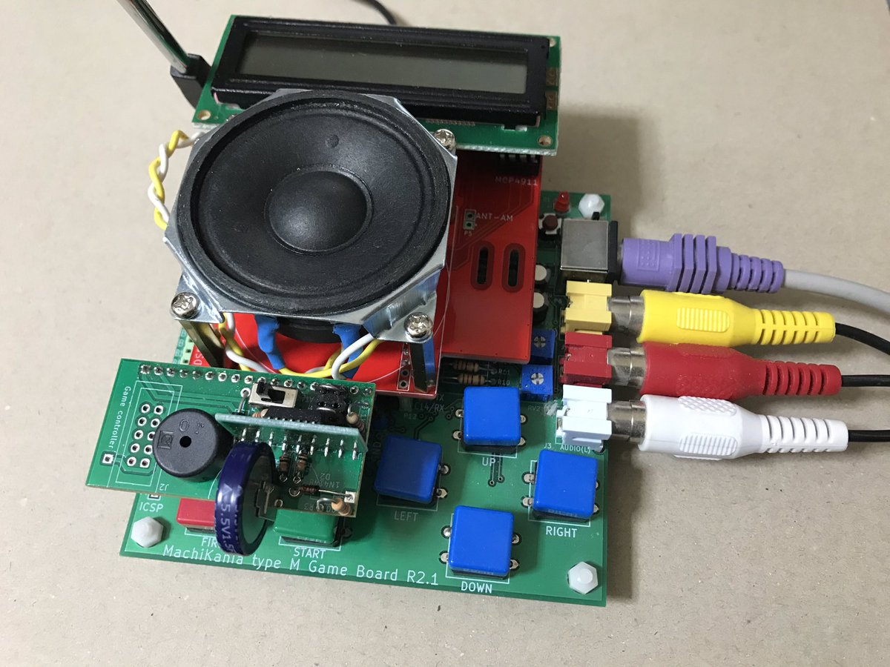
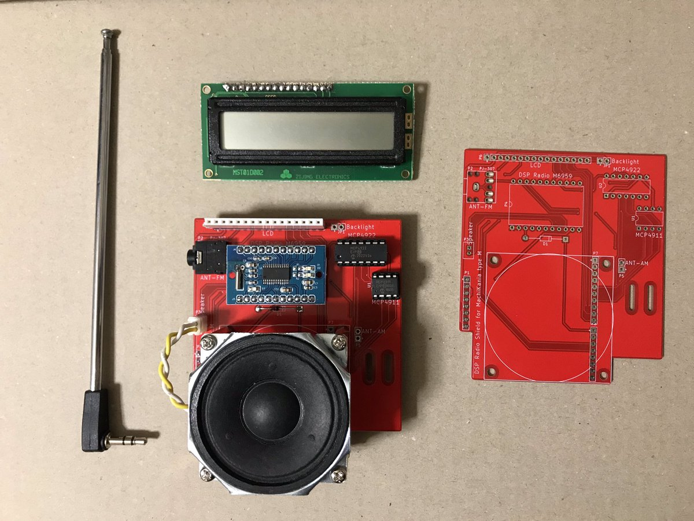

# MachiKania type M用DSPラジオシールド
aitendoの2020年正月の福袋に入っていたDSPラジオ基板M6959と16x2のキャラクター液晶を使って、MachiKania type M用ラジオシールドを作成しました。  
  
  
 
## プログラムの走らせ方
クラスライブラリBUTTON.BAS、CHRLCD.BAS、RTC.BASをメインプログラムDSPRADIO.BASと同じディレクトリまたはLIBディレクトリ配下の各クラス名のディレクトリにコピーし、メインプログラムを実行。  
  
RTCクラスライブラリRTC.BASは下記の工作魂さんのサイトからダウンロードする。  
  
## 操作方法
＜選局モード＞  
　↑↓　　　音量調節  
　←→　　登録された放送局を選択  
　START 　チューニングモードに移行  
　FIRE　　長押しで時計設定  
  
＜チューニングモード＞  
　↑↓　　　音量調節  
　←→　　周波数調節。長押しでスピードアップ  
　START 　選局モードに移行。長押しでサーチモードに移行  
　FIRE　　バンド変更。長押しで時計設定  
  
＜サーチモード＞  
　↑↓　　　音量調節  
　START 　サーチ停止し、チューニングモードに復帰  
  
＜時計設定モード＞  
　↑↓　　　値変更。長押しでスピードアップ  
　←→　　年月日時分秒の移動  
　START 　設定キャンセルし元に戻る  
　FIRE　　時計設定更新し元に戻る  
  
## 参考サイト
工作魂さんによるMachiKania type M用AE-RTC-4543SA-V2のクラスライブラリ  
https://github.com/kosaku-damashii/MachiKania-RTC  
